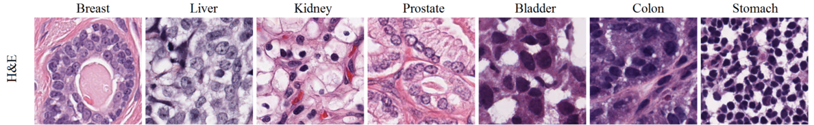
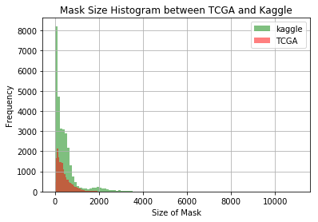
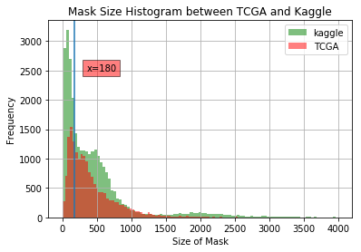
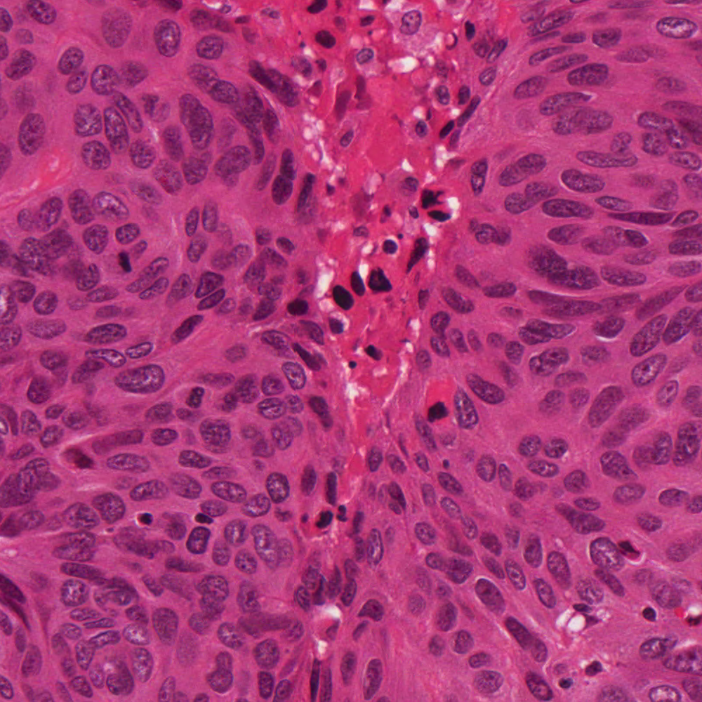

# External Dataset

## NIH-TCGA (The Cancer Genome Atlas)

* TCGA web https://cancergenome.nih.gov/
* datset https://nucleisegmentationbenchmark.weebly.com
* paper   https://drive.google.com/file/d/0ByERBiBsEbuTOEJISEpwSkR0SlE/view


* dataset number: 30 
  * Breast 6
  * Liver 6
  * Kidney 6
  * Prostate 6
  * Bladder 2
  * Colon 2
  * Stomach 2

* pixel: 1000x1000
* nuceli: 16966, max 1863, min 294
* stain: H&E 


google drive: AI Labs >> Project Execution >> Kaggle_2018_DSB >> ExternalData >> external_TCGA_train.tar.gz

```
external_TCGA_train            <-- Root folder
├── TCGA-18-5592-01Z-00-DX1  <-- folder 1
│   ├── images                 <-- one png file w/ H&E stain
│   └── masks                  <-- indivitual mask files
│
├── TCGA-21-5784-01Z-00-DX1  <-- folder 2
│   ├── images                 <-- one png file w/ H&E stain
│   └── masks                  <-- indivitual mask files
│
│
└── TCGA-RD-A8N9-01A-01-TS1  <-- folder 30
     ├── images                 <-- one png file w/ H&E stain
     └── masks                  <-- indivitual mask files

```

<table>
<tr>
    <td> 
        </img>
    </td>
    <td>
        </img>
    </td>
</tr>
</table>



```python

```
